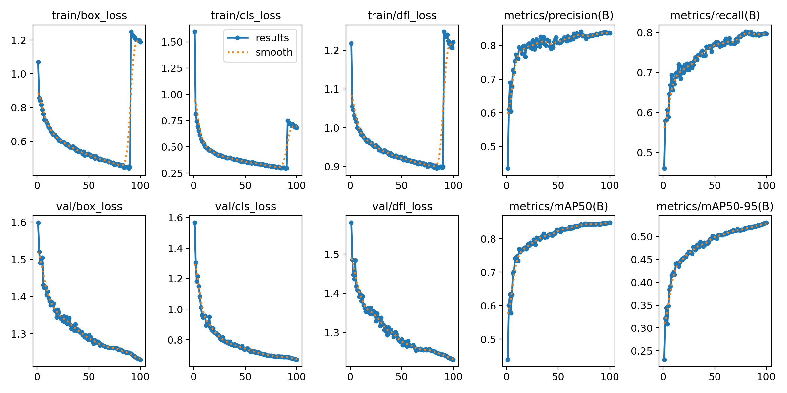
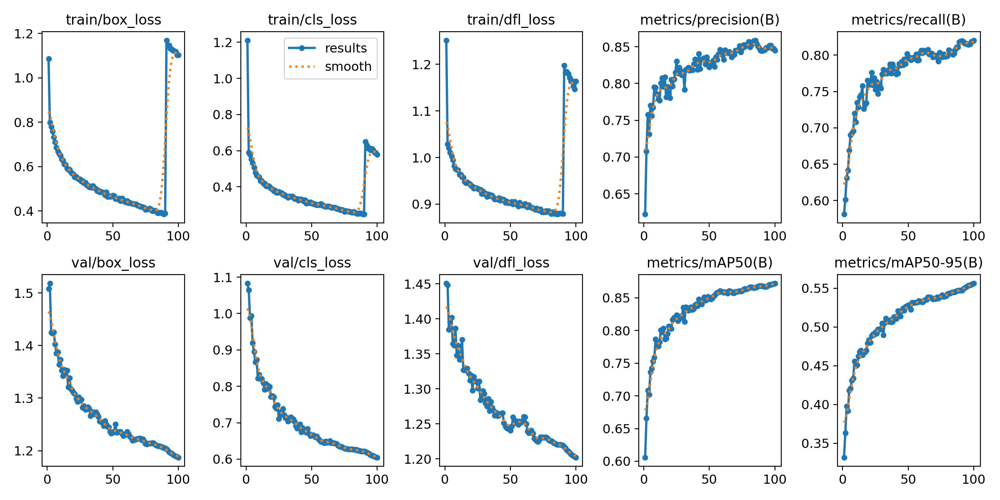
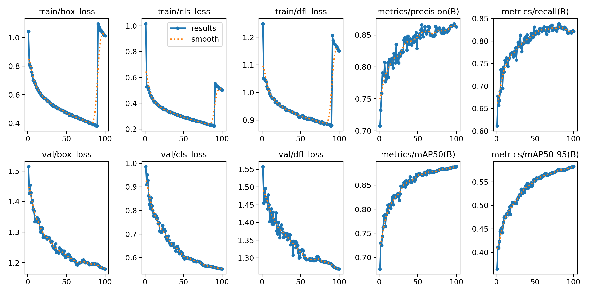
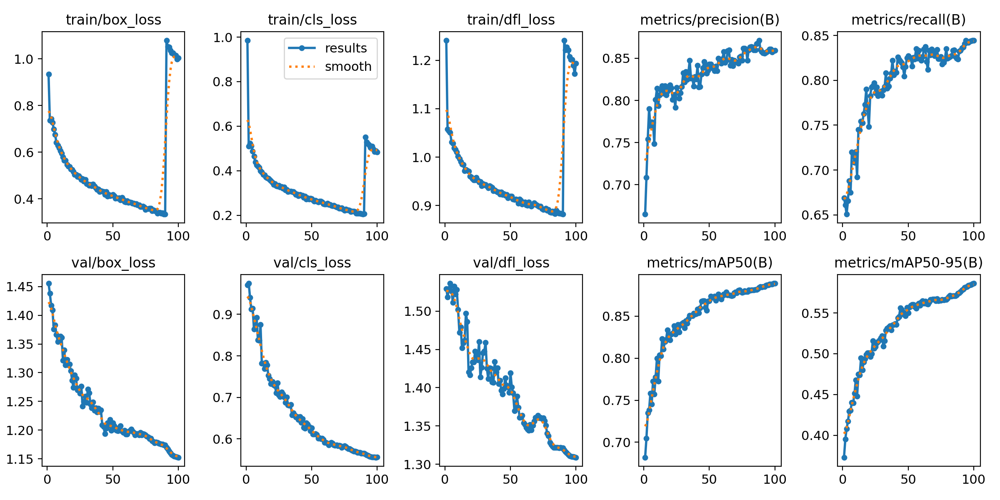
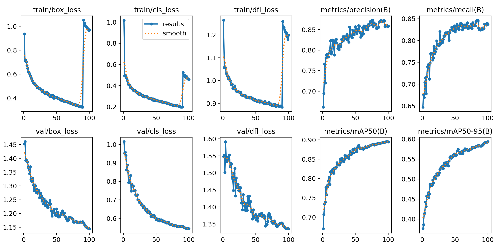

# Enhancing face mask detection performance with comprehensive dataset and YOLOv8
## Dataset Larxel - Face Mask Dataset (LFMD) and Mikolaj Mikolaj Witkowski Medical Mask Dataset (MW-MMD) - FMD+MMD
Table 1. DRFMD dataset.
|| Train | Valid | Test |Total|
| ------------- | ------------- |------------- |-------------|-------------|
||Images|10304|1474|2949|14727|
|Instances|20603|3052|6191|29846|
|Without Mask (0)|9683|1392|3082|14157|
|With Mask (1)|8926|1370|2527|11590|
|Wear Mask Incorrect (2)|1994|290|582|2866|

Table 2. Training performance detail for 5 models YOLOv8 on DRFMD dataset
| Model  | Class | Images | Instances | Precision (P) | Recall (R) | mAP@50	| mAP@50-95 |
| ------------- | ------------- |------------- |------------- |------------- |------------- |------------- |------------- |
|YOLOv8n|all|1474|3052|0.838|0.796|0.849|0.531|
||0|660|1392|0.846|0.742|0.820|0.498|
||1|699|1370|0.863|0.809|0.884|0.546|
||2|274|290|0.804|0.838|0.842|0.549|
|YOLOv8s|all|1474|3052|0.845|0.820|0.872|0.557|
||0|660|1392|0.848|0.767|0.847|0.533|
||1|699|1370|0.883|0.856|0.907|0.578|
||2|274|290|0.804|0.838|0.862|0.559|
|YOLOv8m|all|1474|3052|0.862|0.823|0.888|0.582|
||0|660|1392|0.867|0.772|0.865|0.551|
||1|699|1370|0.911|0.866|0.928|0.605|
||2|274|290|0.809|0.832|0.873|0.591|
|YOLOv8l|all|1474|3052|0.859|0.844|0.889|0.586|
||0|660|1392|0.861|0.799|0.865|0.553|
||1|699|1370|0.895|0.875|0.922|0.612|
||2|274|290|0.822|0.859|0.880|0.594|
|YOLOv8x|all|1474|3052|0.859|0.838|0.895|0.593|
||0|660|1392|0.872|0.797|0.881|0.574|
||1|699|1370|0.899|0.878|0.931|0.617|
||2|274|290|0.807|0.838|0.874|0.589|

<figure>
  
  <figcaption>Figure 1. Training performance using YOLOv8n with DRFMD dataset</figcaption>
</figure>

<figure>
  
  <figcaption>Figure 2. Training performance using YOLOv8s with DRFMD dataset</figcaption>
</figure>

<figure>
  
  <figcaption>Figure 3. Training performance using YOLOv8m with DRFMD dataset</figcaption>
</figure>

<figure>
  
  <figcaption>Figure 4. Training performance using YOLOv8l with DRFMD dataset</figcaption>
</figure>

<figure>
  
  <figcaption>Figure 5. Training performance using YOLOv8x with DRFMD dataset</figcaption>
</figure>

Table 3.  Testing Result of YwDRFMD models on DRFMD Test set 
| Model  | Class | Images | Instances | Precision (P) | Recall (R) | mAP@50	| mAP@50-95 |
| ------------- | ------------- |------------- |------------- |------------- |------------- |------------- |------------- |
|YOLOv8n|all|2949|6191|0.840|0.756|0.814|0.507|
||0|1309|3082|0.845|0.674|0.747|0.443|
||1|1400|2527|0.850|0.774|0.848|0.540|
||2|549|582|0.824|0.820|0.846|0.539|
|YOLOv8s|all|2949|6191|0.839|0.797|0.844|0.536|
||0|1309|3082|0.847|0.716|0.793|0.482|
||1|1400|2527|0.864|0.829|0.883|0.567|
||2|549|582|0.805|0.847|0.855|0.559|
|YOLOv8m|all|2949|6191|0.858|0.800|0.856|0.553|
||0|1309|3082|0.862|0.713|0.795|0.498|
||1|1400|2527|0.890|0.854|0.907|0.591|
||2|549|582|0.821|0.833|0.865|0.569|
|YOLOv8l|all|2949|6191|0.866|0.811|0.867|0.560|
||0|1309|3082|0.863|0.739|0.814|0.510|
||1|1400|2527|0.882|0.856|0.906|0.600|
||2|549|582|0.853|0.840|0.881|0.569|
|YOLOv8x|all|2949|6191|0.860|0.827|0.874|0.567|
||0|1309|3082|0.867|0.752|0.822|0.525|
||1|1400|2527|0.879|0.865|0.912|0.600|
||2|549|582|0.833|0.864|0.887|0.574|

Table 4.  Testing Result of YwDRFMD models on FMMD Test set 
| Model  | Class | Images | Instances | Precision (P) | Recall (R) | mAP@50	| mAP@50-95 |
| ------------- | ------------- |------------- |------------- |------------- |------------- |------------- |------------- |
|YOLOv8n|all|507|2663|0.810|0.686|0.737|0.371|
||0|176|449|0.837|0.648|0.745|0.329|
||1|462|2122|0.872|0.785|0.847|0.418|
||2|75|92|0.723|0.625|0.619|0.367|
|YOLOv8s|all|507|2663|0.814|0.715|0.772|0.372|
||0|176|449|0.825|0.695|0.760|0.315|
||1|462|2122|0.874|0.819|0.867|0.415|
||2|75|92|0.742|0.630|0.689|0.387|
|YOLOv8m|all|507|2663|0.807|0.750|0.783|0.359|
||0|176|449|0.768|0.746|0.756|0.305|
||1|462|2122|0.848|0.830|0.858|0.394|
||2|75|92|0.805|0.674|0.735|0.379|
|YOLOv8l|all|507|2663|0.771|0.758|0.776|0.358|
||0|176|449|0.744|0.742|0.758|0.306|
||1|462|2122|0.819|0.827|0.851|0.402|
||2|75|92|0.751|0.707|0.719|0.367|
|YOLOv8x|all|507|2663|0.830|0.753|0.800|0.374|
||0|176|449|0.809|0.690|0.775|0.327|
||1|462|2122|0.867|0.861|0.899|0.420|
||2|75|92|0.815|0.707|0.725|0.376|

Table 5.  Testing Result of YwDRFMD models on HITL-MMD Test set 
| Model  | Class | Images | Instances | Precision (P) | Recall (R) | mAP@50	| mAP@50-95 |
| ------------- | ------------- |------------- |------------- |------------- |------------- |------------- |------------- |
|YOLOv8n|all|1311|2964|0.778|0.646|0.705|0.452|
||0|462|807|0.819|0.635|0.762|0.468|
||1|1030|2030|0.931|0.817|0.901|0.598|
||2|106|127|0.584|0.487|0.453|0.291|
|YOLOv8s|all|1311|2964|0.778|0.698|0.731|0.455|
||0|462|807|0.851|0.685|0.789|0.469|
||1|1030|2030|0.925|0.856|0.919|0.585|
||2|106|127|0.557|0.551|0.486|0.311|
|YOLOv8m|all|1311|2964|0.795|0.716|0.779|0.478|
||0|462|807|0.841|0.725|0.818|0.486|
||1|1030|2030|0.933|0.88|0.941|0.572|
||2|106|127|0.611|0.543|0.579|0.374|
|YOLOv8l|all|1311|2964|0.787|0.712|0.769|0.458|
||0|462|807|0.843|0.706|0.805|0.483|
||1|1030|2030|0.922|0.870|0.932|0.544|
||2|106|127|0.596|0.559|0.571|0.346|
|YOLOv8x|all|1311|2964|0.786|0.715|0.770|0.455|
||0|462|807|0.834|0.714|0.815|0.482|
||1|1030|2030|0.928|0.870|0.935|0.549|
||2|106|127|0.597|0.560|0.560|0.336|
