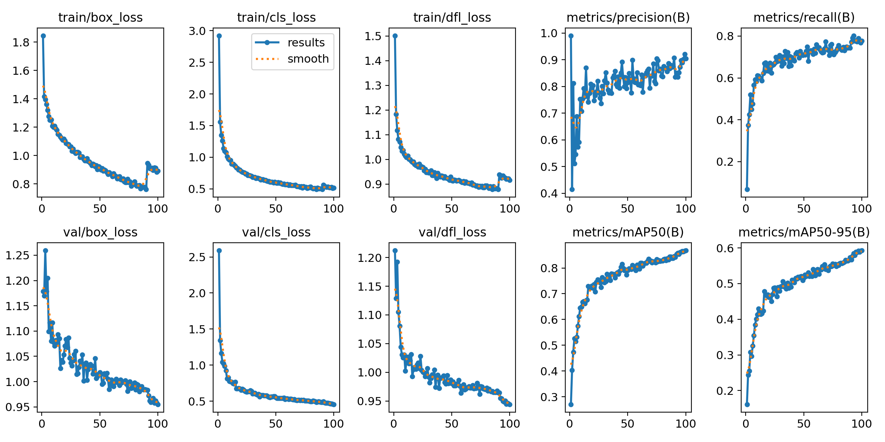
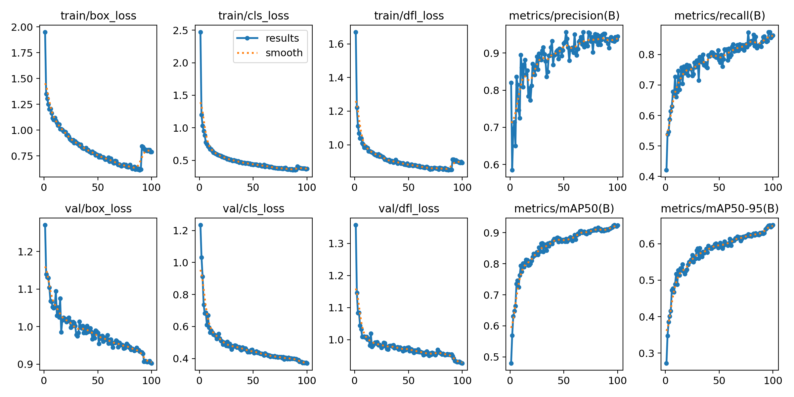
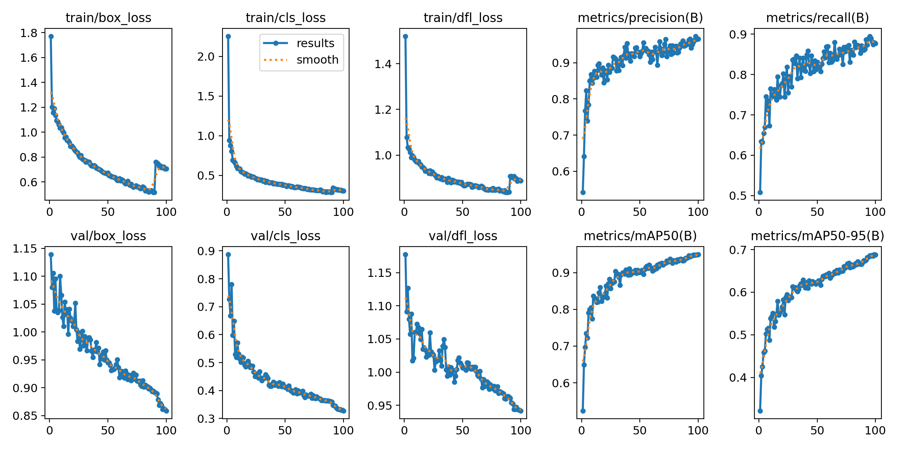
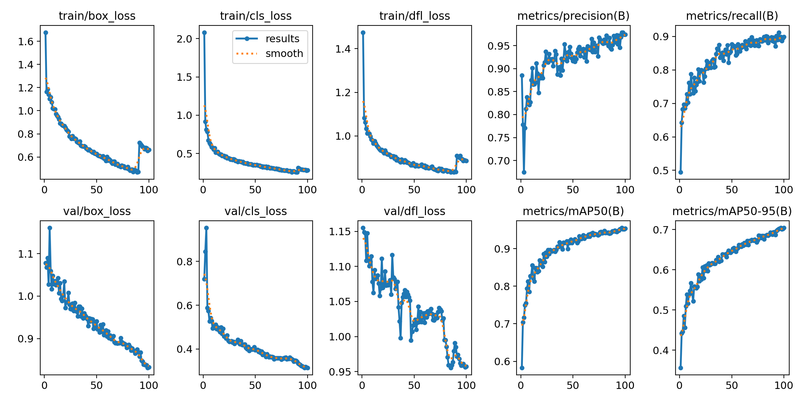
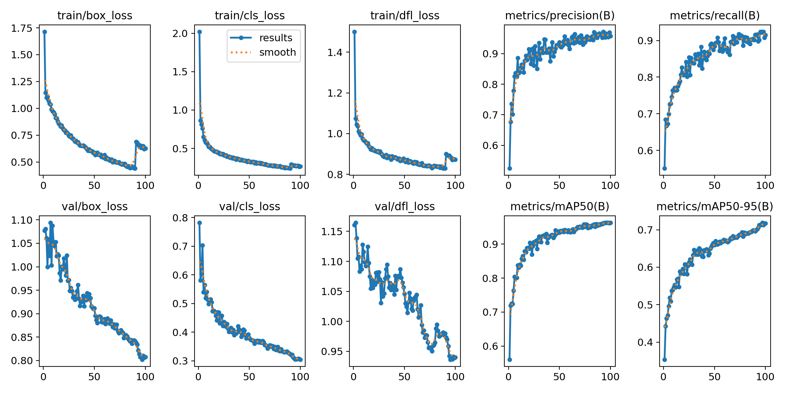

# Enhancing-Face-Mask-Detection-A-Comprehensive-Dataset-and-Performance-Evaluation-Using-YOLOv8
## Dataset Larxel - Face Mask Dataset (LFMD) and Mikolaj Mikolaj Witkowski Medical Mask Dataset (MW-MMD) - FMD+MMD
Table 1. Detail of FMMD (FMD+MMD) dataset.
|| Train | Valid | Test |
| ------------- | ------------- |------------- |-------------|
|Images|1067|456|507|
|Instances|5796|2156|2663|
|Without Mask|1030|352|449|
|With Mask|4589|1728|2122|
|Wear Mask Incorrect|177|76|92|

Table 2. Training performance detail for 5 models YOLOv8 on FMMD dataset
| Model  | Class | Images | Instances | Precision (P) | Recall (R) | mAP@50	| mAP@50-95 |
| ------------- | ------------- |------------- |------------- |------------- |------------- |------------- |------------- |
|YOLOv8n|all|456|2156|0.904|0.777|0.868|0.593|
||0|143|352|0.882|0.740|0.858|0.564|
||1|405|1728|0.950|0.908|0.956|0.679|
||2|62|76|0.879|0.684|0.788|0.536|
|YOLOv8s|all|456|2156|0.945|0.863|0.924|0.652|
||0|143|352|0.924|0.830|0.925|0.614|
||1|405|1728|0.958|0.940|0.973|0.711|
||2|62|76|0.954|0.818|0.873|0.631|
|YOLOv8m|all|456|2156|0.966|0.879|0.948|0.688|
||0|143|352|0.949|0.858|0.950|0.656|
||1|405|1728|0.972|0.936|0.978|0.728|
||2|62|76|0.977|0.842|0.917|0.681|
|YOLOv8l|all|456|2156|0.979|0.898|0.956|0.705|
||0|143|352|0.957|0.852|0.954|0.674|
||1|405|1728|0.980|0.949|0.981|0.744|
||2|62|76|1.00|0.894|0.931|0.696|
|YOLOv8x|All|456|2156|0.955|0.924|0.963|0.719|
||0|143|352|0.938|0.908|0.960|0.683|
||1|405|1728|0.975|0.957|0.982|0.753|
||2|62|76|0.952|0.908|0.946|0.722|

<figure>
  
  <figcaption>Figure 1. Training performance using YOLOv8n with FMMD dataset</figcaption>
</figure>

<figure>
  
  <figcaption>Figure 2. Training performance using YOLOv8s with FMMD dataset</figcaption>
</figure>

<figure>
  
  <figcaption>Figure 3. Training performance using YOLOv8m with FMMD dataset</figcaption>
</figure>

<figure>
  
  <figcaption>Figure 4. Training performance using YOLOv8l with FMMD dataset</figcaption>
</figure>

<figure>
  
  <figcaption>Figure 5. Training performance using YOLOv8x with FMMD dataset</figcaption>
</figure>

Table 3. Testing Result of YwFMMD models on FMMD Testset
| Model  | Class | Images | Instances | Precision (P) | Recall (R) | mAP@50	| mAP@50-95 |
| ------------- | ------------- |------------- |------------- |------------- |------------- |------------- |------------- |
|YOLOv8n|all|507|2663|0.904|0.818|0.876|0.637|
||0|176|449|0.871|0.804|0.871|0.595|
||1|462|2122|0.943|0.899|0.933|0.703|
||2|75|92|0.899|0.750|0.825|0.614|
|YOLOv8s|all|507|2663|0.927|0.873|0.920|0.698|
||0|176|449|0.900|0.864|0.918|0.652|
||1|462|2122|0.948|0.928|0.952|0.751|
||2|75|92|0.931|0.826|0.889|0.691|
|YOLOv8m|all|507|2663|0.968|0.883|0.937|0.739|
||0|176|449|0.955|0.889|0.947|0.706|
||1|462|2122|0.976|0.924|0.961|0.779|
||2|75|92|0.973|0.837|0.904|0.733|
|YOLOv8l|all|507|2663|0.973|0.922|0.967|0.773|
||0|176|449|0.967|0.907|0.964|0.742|
||1|462|2122|0.986|0.956|0.984|0.807|
||2|75|92|0.966|0.902|0.953|0.771|
|YOLOv8x|all|507|2663|0.966|0.917|0.948|0.768|
||0|176|449|0.960|0.911|0.942|0.723|
||1|462|2122|0.976|0.925|0.954|0.800|
||2|75|92|0.963|0.913|0.948|0.780|

Table 4. Testing Result of YwFMMD models on DRFMD Testset
| Model  | Class | Images | Instances | Precision (P) | Recall (R) | mAP@50	| mAP@50-95 |
| ------------- | ------------- |------------- |------------- |------------- |------------- |------------- |------------- |
|YOLOv8n|all|2949|6191|0.702|0.577|0.604|0.264|
||0|1309|3082|0.771|0.510|0.561|0.200|
||1|1400|2527|0.644|0.738|0.696|0.316|
||2|549|582|0.691|0.482|0.555|0.277|
|YOLOv8s|all|2949|6191|0.712|0.595|0.615|0.275|
||0|1309|3082|0.772|0.542|0.597|0.219|
||1|1400|2527|0.662|0.740|0.706|0.326|
||2|549|582|0.703|0.503|0.542|0.280|
|YOLOv8m|all|2949|6191|0.720|0.632|0.655|0.298|
||0|1309|3082|0.763|0.576|0.618|0.235|
||1|1400|2527|0.661|0.753|0.720|0.336|
||2|549|582|0.736|0.565|0.628|0.324|
|YOLOv8l|all|2949|6191|0.719|0.634|0.658|0.302|
||0|1309|3082|0.786|0.553|0.619|0.234|
||1|1400|2527|0.702|0.739|0.725|0.340|
||2|549|582|0.670|0.610|0.628|0.331|
|YOLOv8x|all|2949|6191|0.691|0.633|0.639|0.291|
||0|1309|3082|0.771|0.568|0.615|0.230|
||1|1400|2527|0.659|0.746|0.721|0.337|
||2|549|582|0.644|0.584|0.582|0.306|

Table 5. Testing Result of YwFMMD models on Medical Mask Test set
| Model  | Class | Images | Instances | Precision (P) | Recall (R) | mAP@50	| mAP@50-95 |
| ------------- | ------------- |------------- |------------- |------------- |------------- |------------- |------------- |
|YOLOv8n|all|1311|2964|0.772|0.596|0.661|0.291|
||0|462|807|0.878|0.572|0.736|0.298|
||1|1030|2030|0.858|0.894|0.906|0.426|
||2|106|127|0.429|0.323|0.340|0.150|
|YOLOv8s|all|1311|2964|0.747|0.626|0.684|0.306|
||0|462|807|0.854|0.638|0.749|0.318|
||1|1030|2030|0.845|0.901|0.910|0.432|
||2|106|127|0.543|0.339|0.395|0.168|
|YOLOv8m|all|1311|2964|0.715|0.653|0.682|0.315|
||0|462|807|0.878|0.684|0.789|0.341|
||1|1030|2030|0.861|0.921|0.935|0.450|
||2|106|127|0.404|0.354|0.323|0.154|
|YOLOv8l|all|1311|2964|0.71|0.635|0.683|0.315|
||0|462|807|0.883|0.638|0.789|0.344|
||1|1030|2030|0.881|0.906|0.924|0.445|
||2|106|127|0.366|0.362|0.335|0.156|
|YOLOv8x|all|1311|2964|0.729|0.650|0.675|0.309|
||0|462|807|0.889|0.667|0.803|0.350|
||1|1030|2030|0.865|0.913|0.926|0.447|
||2|106|127|0.432|0.370|0.296|0.130|
